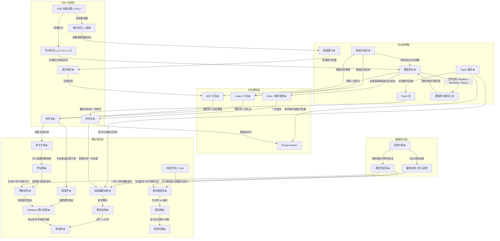
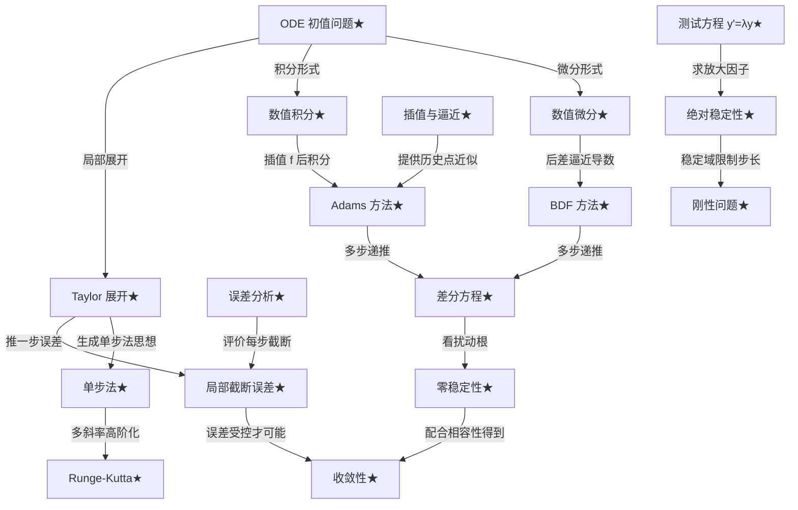
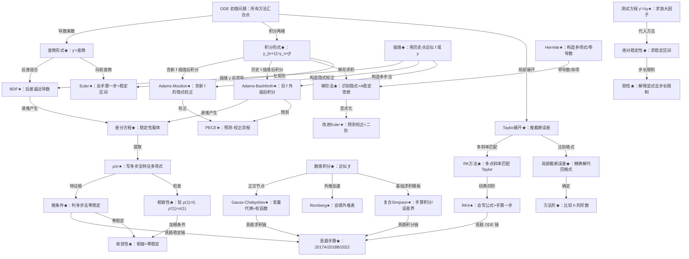

# ODE 中心数值分析关系型知识图谱

## 第一部分：材料审计

| 材料 | 是否读取 | 读取结论 |
|---|---|---|
| `期末/数值分析1-5章导读与考试网格.md` | 已读取 | 文件存在，约 41 KB；包含五章文件审计、章节导读、知识网格、往年题映射。 |
| `期末/第四五章教材导读与手算模板.md` | 已读取 | 文件存在，约 39 KB；重点覆盖第四章数值积分/微分、第五章 ODE、手算模板、题型模板。 |
| 第一章教材 PDF | 已读取 | `误差分析/第一章2026.pdf` 与 `误差分析/1-理论/第一章讲义.pdf` 可抽取文本；主题为误差、有效数字、机器误差、稳定性、病态与条件数。 |
| 第二章教材 PDF | 已读取 | `插值/第二章.pdf` 可抽取文本；主题为 Lagrange、Newton 差商、Hermite、分段插值、样条。 |
| 第三章教材 PDF | 已读取 | `逼近/第三章2026(1).pdf` 可抽取文本；主题为最佳一致逼近、正交多项式、Chebyshev、Legendre、最佳平方逼近、最小二乘。 |
| 第四章教材 PDF | 已读取 | `数值积分/第四章2026.pdf` 可抽取文本；主题为 Newton-Cotes、复合梯形/Simpson、Romberg、带导数求积、Gauss、数值微分。 |
| 第五章教材 PDF | 已读取 | `数值ODE/第五章.pdf` 可抽取文本；目录明确包含基于插值型数值积分、插值型数值微分、Taylor 级数展开构造多步法，以及相容性、收敛性、稳定性、绝对稳定性。 |
| 作业文件 | 已读取 | 已读取相关 TeX/PDF：习题一、二、三、四、五及上机报告；PNG 题图未 OCR，只按文件名和 TeX 标题确认题号。 |
| 往年题 | 已读取 | 重点读取 `2017A.pdf`、`2018A.pdf`、`2018B.pdf`、`2022FNL.pdf`、`2022NA1FNL.pdf`；2011-2015、2019、2020 部分文本乱码，只作关键词级映射。 |

## 第二部分：总主线

数值分析前五章不是五块孤立内容，而是在解决同一个问题：怎样把连续、无限、不可精确存储的数学对象，改造成有限步、有限点、有限精度的可计算过程。第一章先给评价语言：近似值准不准，要看绝对误差、相对误差、有效数字；计算过程靠不靠谱，要看舍入误差是否被放大、问题是否病态、算法是否稳定。没有这套语言，后面所有“方法好不好”都无法判断。

Taylor 展开给出局部近似语言。截断误差、本质上就是把 Taylor 级数截断后的余项；数值微分用 Taylor 展开比较前向、后向、中心差商；ODE 中的 Taylor 法、局部截断误差和 RK 阶条件，也都来自“把真解在一步内展开，再让数值格式尽量匹配”。这条线解释了为什么 Euler 一阶、改进 Euler 二阶、RK4 四阶。

插值提供“有限点代替函数”的语言。Lagrange、Newton 差商、Hermite 不只是第二章内容，它们进入第四章成为插值型求积：先用插值多项式近似被积函数，再积分，就得到 Newton-Cotes、梯形、Simpson；进入第五章后，用过去若干点对 `f(t,y(t))` 插值再积分，就得到 Adams-Bashforth 和 Adams-Moulton；用过去若干 `y` 值插值后求导，就得到 BDF。差商也自然变成差分方程和多步法的代数骨架。

逼近与正交提供“整体最优”的语言。最小二乘和正交投影说明怎样在整体误差意义下选近似；Chebyshev 节点说明怎样避免高次插值端点振荡；正交多项式进入 Gauss 求积，使同样节点数得到最高代数精度。它们不一定直接生成基础 ODE 手算格式，但影响高精度求积、隐式 RK 的 Gauss 思想、误差控制和稳定节点选择。

ODE 数值解法是这些思想的汇合点。ODE 既可写成积分形式 `y_{n+1}=y_n+∫f`，于是数值积分直接生成 Euler、梯形、Adams；也可写成微分形式 `y'=f`，于是差商替代导数生成 Euler、后退 Euler、BDF；还可用 Taylor 展开直接匹配一步内的真解，生成 Taylor 法和 Runge-Kutta。最后，所有离散格式都会变成差分方程，误差递推把第一章的稳定性语言推到第五章的相容性、零稳定性、收敛性、绝对稳定性和刚性问题。

## 第三部分补充：压缩概念版思维导图

这一版用于复习时先看主线。它不展开算法细枝，只保留“前四章如何汇入数值 ODE”的概念关系。

### A. 概念关系总图

### B. 考前极简图

### 压缩图读法

ODE 是前四章的汇合点，因为它既能写成导数方程，也能写成积分方程，还能在每一步用 Taylor 展开描述局部真解。于是前四章的近似工具都会自然进入第五章。

单步法主要来自 Taylor 和数值积分。Taylor 展开告诉你一步内真解应该长什么样；Euler、梯形思想则来自对积分形式中 `∫f` 的粗略或平均近似；Runge-Kutta 是用多个斜率去模拟 Taylor 展开的高阶信息。

多步法主要来自插值和数值积分。Adams 方法的本质是：用过去若干个 `f(t,y)` 值插值或外推，再把这个插值函数积分，所以它同时依赖插值思想和数值积分思想。

BDF 来自数值微分。它不先近似积分，而是用过去和当前的 `y` 值构造差分，直接逼近 `y'`，再令这个差分等于 `f(t,y)`。

稳定性理论要用差分方程和测试方程。多步法会产生递推关系，扰动是否放大取决于差分方程的特征根；绝对稳定性则用测试方程 `y'=λy` 看固定步长下数值解是否保持衰减，这正是刚性问题的核心。

考前复习顺序：先走 Taylor → 局部截断误差 → 单步法 → RK；再走积分形式 → 数值积分 → Adams；再走微分形式 → 数值微分 → BDF；最后集中做差分方程 → 零稳定性，以及测试方程 → 绝对稳定性 → 刚性。

一句话总结：数值分析前五章通过 Taylor、插值逼近、数值积分、数值微分和误差稳定性理论，最终汇入“如何把 ODE 初值问题离散成可靠递推格式”。

## 第三部分：关系型知识导图 Mermaid 大图

原详细大图已由上面的“压缩概念版思维导图”取代。复习时以压缩版的“概念关系总图”和“考前极简图”为主，避免节点过多影响主线判断。

## 第四部分：ODE 中心版知识导图解释

### 1. 为什么 ODE 是第五章的汇合点

ODE 初值问题同时具有三种入口：它是导数方程，所以能用差商离散；它能积分成一步更新公式，所以能用数值积分离散；它的精确解在局部可 Taylor 展开，所以能用 Taylor/RK 匹配局部行为。前四章分别提供误差语言、插值语言、逼近语言、积分/微分语言，第五章把这些语言变成可递推的算法。

### 2. Taylor 展开如何进入

数值微分：前向、后向、中心差商的阶数都靠 Taylor 展开比较余项。

Taylor 法：把 `y(t+h)` 展开成 `y, y', y'', ...`，截断后得到一步格式。

RK 阶条件：RK 不直接求高阶导数，而是用多个斜率的线性组合去匹配 Taylor 展开的系数。

局部截断误差：把精确解代入数值格式，再用 Taylor 展开比较两边差多少。

### 3. 插值如何进入

Newton-Cotes：先用 Lagrange 插值多项式近似 `f(x)`，再积分得到梯形、Simpson 等。

Adams-Bashforth：用旧的 `f_n,f_{n-1},...` 对 `f(t,y(t))` 外插，再对一步区间积分，得到显式多步法。

Adams-Moulton：把新点 `f_{n+1}` 也纳入插值，再积分，得到隐式校正公式。

BDF：不是插值 `f` 后积分，而是插值过去和当前的 `y`，再对插值多项式求导来逼近 `y'`。

### 4. 数值积分如何进入

Euler：积分形式中用左矩形近似 `∫f`。

后退 Euler：用右矩形近似 `∫f`，所以隐式。

梯形法：用两端斜率平均近似 `∫f`，稳定性好于显式 Euler。

Simpson 思想：一段内多点斜率加权平均，这种“多点斜率平均”的思想和 RK 构造非常接近。

Adams 方法：本质就是对 `∫_{t_n}^{t_{n+1}} f(t,y(t))dt` 使用由历史点构造的插值型求积。

### 5. 数值微分如何进入

差商：把 `y'` 换成前向、后向或中心差商，得到差分格式。

BDF：用后差组合逼近当前导数，得到后退差分公式；它通常是隐式格式。

高阶 ODE 化一阶系统：高阶导数问题先改写为一阶系统，再对系统应用 Euler/RK/多步法；这是上机和应用题常用入口。

### 6. 误差分析如何进入

局部截断误差：每一步公式本身对精确解造成的误差。

整体误差：局部误差经过多步递推累积后的误差。

相容性：当 `h→0` 时，差分方程是否逼近原微分方程。

零稳定性：历史误差在多步递推中是否被特征根放大。

收敛性：多步法的核心结论是相容性加零稳定性推出收敛。

绝对稳定性：把方法用于测试方程 `y'=λy`，看固定步长下衰减问题是否仍衰减。

刚性问题：精确解中有快速衰减模式，显式法为了稳定被迫取极小步长，隐式法或 BDF 更有优势。

### 7. 逼近与正交如何进入

Gauss 求积：正交多项式的零点给出最优节点，使插值型求积达到最高代数精度。

最小二乘：它是离散数据的整体拟合思想，与误差平方最小和正交投影相连。

正交多项式：既是最佳平方逼近的自然坐标，也为 Gauss-Legendre、Gauss-Chebyshev 提供节点。

Chebyshev 思想：一方面用交错刻画最佳一致逼近，另一方面用节点选择降低插值余项，避免 Runge 现象。

高精度求积和稳定节点选择：Gauss 节点、Chebyshev 节点说明“节点位置”本身就是算法稳定性和精度的一部分。

## 第五部分：考试导向小图

## 第六部分：关键边表

| 上游概念 | 下游概念 | 关系类型 | 为什么相连 | 对应公式 | 考试怎么考 | 优先级 |
|---|---|---|---|---|---|---|
| ODE 初值问题 | 积分形式 | 来源 | 对方程两端从 `t_n` 积到 `t_{n+1}` | `y_{n+1}=y_n+∫f` | 写出积分形式并识别离散来源 | A |
| ODE 初值问题 | 微分形式 | 来源 | 原方程就是导数关系 | `y'=f(t,y)` | 用差商替代导数 | A |
| Taylor 展开 | 局部截断误差 | 误差分析 | 精确解代入格式后比较 Taylor 余项 | `R_n=O(h^{p+1})` | 2022 中点 Euler 型局部误差 | A |
| Taylor 展开 | RK 方法 | 推导 | 多点斜率加权匹配 Taylor 系数 | `Σb_i k_i` 匹配展开 | 推 RK2/RK4 阶或写公式 | A |
| Taylor 展开 | 数值微分 | 推导 | 展开 `f(x±h)` 得差商误差 | 前/后/中心差商 | 求差分公式截断误差 | A |
| 数值微分 | BDF | 推导 | 用后差近似当前导数 | `Σ a_j y_{n+j}=hβ f_{n+k}` | 待定系数或后差导出 | A |
| 插值思想 | Newton-Cotes | 推导 | 插值多项式积分得到求积公式 | `A_i=∫l_i(x)dx` | 求求积系数和代数精度 | A |
| Hermite 插值 | 带导数求积 | 推导 | 函数值和导数同时参与求积 | 修正梯形/Simpson | 2017A 带导数求积余项 | A |
| 插值 `f` | Adams-Bashforth | 推导 | 旧斜率外插后积分 | 二步 AB：`y_{n+1}=y_n+h/2(3f_n-f_{n-1})` | 给历史值手算一步 | A |
| 插值 `f` | Adams-Moulton | 推导 | 含新斜率内插后积分 | 梯形/AM 公式 | 识别隐式校正 | A |
| Adams-Bashforth | PECE | 算法实现 | AB 先预测 | P: predictor | 写预测-校正流程 | A |
| Adams-Moulton | PECE | 算法实现 | AM 后校正 | C: corrector | 判断 PECE 步骤 | A |
| RK4 | Adams 起步值 | 算法实现 | 多步法需要前几步高阶初值 | `y_1,y_2,y_3` | 解释 Adams 为什么不能直接启动 | A |
| 正交多项式 | Gauss 求积 | 来源 | 正交多项式零点给最高代数精度节点 | 最高 `2n-1` 或 `2n+1` | 求节点、权重、精确度 | A |
| Chebyshev 多项式 | Gauss-Chebyshev | 来源 | Chebyshev 权函数对应正交节点 | `x_k=cos((2k-1)π/(2n))` | 2017A/2022 变量代换 | A |
| Chebyshev 节点 | 插值误差控制 | 误差分析 | 降低节点多项式最大值 | `ω_{n+1}` 最小化思想 | 解释 Runge 现象如何缓解 | B |
| 数值积分 | Euler | 推导 | 积分形式用左矩形 | `y_{n+1}=y_n+h f_n` | 手算一步、求稳定区间 | A |
| 数值积分 | 梯形法 | 推导 | 积分形式用梯形公式 | `y_{n+1}=y_n+h/2(f_n+f_{n+1})` | 判断隐式和稳定性 | A |
| 梯形法 | 改进 Euler | 算法实现 | 用 Euler 预测终点再显式校正 | 预测-校正二阶格式 | 手算预测校正 | A |
| Simpson 思想 | RK 方法 | 来源 | 多点斜率加权平均与 Simpson 权重类似 | RK4 权重 `1,2,2,1` | 写 RK4 并手算 | A |
| 多步法 | 差分方程 | 来源 | 多步递推本质是 k 阶差分方程 | `Σα_j y_{n+j}=hΣβ_j f_{n+j}` | 写 ρ、σ | A |
| 差分方程 | 根条件 | 稳定性分析 | 齐次误差方程解由特征根控制 | `ρ(λ)=0` | 判零稳定 | A |
| ρ、σ | 相容性 | 稳定性分析 | 多步法逼近微分方程的必要条件 | `ρ(1)=0, ρ'(1)=σ(1)` | 2022 多步法判断 | A |
| 相容性 | 收敛性 | 稳定性分析 | 仅相容不够，需零稳定 | 相容 + 根条件 | 判断是否收敛 | A |
| 零稳定性 | 收敛性 | 稳定性分析 | 控制误差不被递推放大 | Dahlquist 等价思想 | 多步法证明题 | A |
| 测试方程 | 绝对稳定性 | 稳定性分析 | 固定步长下看放大因子 | `y'=λy`, `z=λh` | 求稳定区间 | A |
| 绝对稳定性 | 刚性问题 | 易错联系 | 刚性使显式法稳定步长极小 | `z=λh` 必须落稳定域 | 问步长限制或方法选择 | A |
| 局部截断误差 | 整体误差 | 误差分析 | 局部误差经递推累积 | `e_n` 估计 | 区分局部/整体阶 | A |
| 显式方法 | 步长限制 | 易错联系 | 显式稳定域通常有限 | Euler `-2<λh<0` | 刚性题选 h | A |
| 隐式方法 | 刚性问题 | 算法实现 | 隐式法稳定域大但需解方程 | 后退 Euler/梯形/BDF | 说明代价与优势 | B |
| Gauss-Chebyshev | 真题手算 | 考试题型 | 2017A、2022 都出现同类积分 | 权函数代换 | 变量代换求精确值 | A |
| Hermite 插值 | 真题手算 | 考试题型 | 2017、2018、2022 多次出现 | Hermite 基函数 | 构造多项式或余项 | A |
| RK4 | 真题手算 | 考试题型 | 2022 填空，作业五第 15/17 | `K1` 到 `K4` | 默写公式、算一步 | A |
| 根条件 | 真题证明 | 考试题型 | 2022 多步法收敛判断 | 单位圆根单根 | 判稳定/收敛 | A |

## 第七部分：从图到复习行动

### 第一轮：ODE 来源链

关系顺序：`Taylor -> 积分形式 -> 差商形式 -> Euler/梯形/RK/Adams/BDF`。

先看材料：`第四五章教材导读与手算模板.md` 的 5.1-5.4，再看 `数值ODE/第五章.pdf` 的目录 5.1、5.3、5.4。

做作业题：习题五第 7、8、13、15、17、23、28、30；上机第五章题一。

做往年题：2022 的 RK4 填空、隐式 RK 稳定题、多步法题、中点 Euler 局部误差题；2013/2014 中能识别的 RK/Euler 题只作补充。

产出笔记：一页“ODE 方法来源表”：每个方法来自 Taylor、积分、插值、微分中的哪条链。

必须会手算：Euler、改进 Euler、RK4 一步、二步 Adams、BDF1/BDF2 识别。

只需理解：自适应 RKF45、Milne 的完整推导。

### 第二轮：误差与稳定链

关系顺序：`局部截断误差 -> 整体误差 -> 相容性 -> 零稳定性 -> 收敛性 -> 绝对稳定性 -> 刚性`。

先看材料：第五章 5.2.3、5.2.4、5.6；再回看第一章稳定性、病态、舍入误差。

做作业题：习题五第 12、30、32、34(2)、36(2)(4)；误差分析上机题三、题四。

做往年题：2022 多步法相容/稳定判断；2022 隐式 RK 绝对稳定；2022 差分方程题。

产出笔记：一页“稳定性判别流程”：先写 ρ、σ，再验相容，再验根条件，再用测试方程求绝对稳定区间。

必须会手算：`ρ(1)=0, ρ'(1)=σ(1)`；求 `ρ` 的根；Euler/改进 Euler/梯形的稳定区间思想。

只需理解：弱稳定/强稳定细节、一般复平面稳定域图形。

### 第三轮：计算模板链

关系顺序：`复合 Simpson/Romberg/Gauss -> RK4 手算 -> Adams 手算 -> 多步法根条件 -> 测试方程稳定区间`。

先看材料：`第四五章教材导读与手算模板.md` 的第四章手算模板、第五章题型模板。

做作业题：习题四第 1、7、21、28、34、37、38、41；习题五第 7、8、15、23、36。

做往年题：2017A 复合 Simpson、Gauss-Chebyshev、带导数求积；2018B Romberg/求积精度/Gauss；2022 Gauss-Chebyshev、RK、多步法。

产出笔记：公式卡，必须含 Simpson 权重、Romberg 递推、Gauss-Chebyshev 节点权重、RK4、Adams、根条件。

必须会手算：复合 Simpson、Romberg 一两层、Gauss-Chebyshev 代换、RK4 一步、二步 AB、根条件。

只需理解：自适应积分完整递归、复合 Gauss 工程实现。

### 第四轮：往年题链

关系顺序：把高频节点直接对应到题。

先看材料：`数值分析1-5章导读与考试网格.md` 的往年题映射，再看原 PDF。

做作业题：按错题倒推作业，插值错就做习题二 12/17/24，积分错就做习题四 7/21/37，ODE 错就做习题五 8/15/36。

做往年题：优先 2022、2018B、2018A、2017A；乱码年份只用来确认高频，不作为第一轮精做。

产出笔记：真题节点表：题号、对应节点、方法来源链、错因、是否重算。

必须会手算：2022 第 5、6、7、8、10、12；2018B 二1、二2、二4、三1、四；2017A 二、四、五、八、九。

只需理解：2011-2015、2019、2020 中乱码题的关键词趋势，具体题干需看原 PDF，不要凭抽取文本猜。

## 一句话总结

数值分析前五章汇入数值 ODE 的方式是：Taylor 给局部展开，插值给历史信息重构，数值积分给一步推进公式，数值微分给差分格式，误差与稳定性理论决定这些递推格式能不能长期可信。
